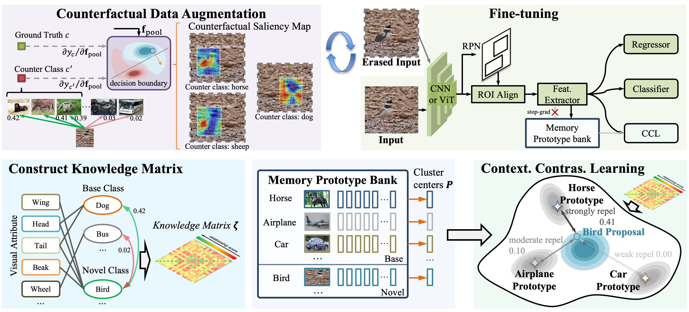

<h2 align="center"> <a href="https://ieeexplore.ieee.org/document/10963743">【TPAMI 2025 🔥】Generalized Semantic Contrastive Learning via Embedding Side Information for Few-Shot Object Detection</a></h2>
<h5 align="center"> If you like our project, please give us a star ⭐ on GitHub for latest update.  </h2>

[](https://arxiv.org/abs/2504.07060)
<!--  -->



## 📰 News & Update

- **[2025.07.01]** We released the code based on the [DeViT](https://github.com/mlzxy/devit) architecture.
- **[2025.04.09]** Our paper was accepted by Journal `IEEE Transactions on Pattern Analysis and Machine Intelligence (TPAMI)`!

## 🗝️ How to Run

The project includes [TFA++](./TFA++/), [MFDC](./MFDC/) and [DeViT](./DeViT) folders. Please enter different folders and follow their commands to reproduce.

## 👍 Acknowledgement

[DeViT](https://github.com/mlzxy/devit): an open-set object detector.

[FsDet](https://github.com/ucbdrive/few-shot-object-detection): Implementations of few-shot object detection benchmarks.

[MFDC](https://github.com/shuangw98/MFDC): Multi-Faceted Distillation of Base-Novel Commonality for Few-shot Object Detection, ECCV 2022.

## ✏️ Citation

```bibtex
@article{chen2025generalized,
  title={Generalized Semantic Contrastive Learning Via Embedding Side Information for Few-Shot Object Detection},
  author={Chen, Ruoyu and Zhang, Hua and Li, Jingzhi and Liu, Li and Huang, Zhen and Cao, Xiaochun},
  journal={IEEE Transactions on Pattern Analysis and Machine Intelligence},
  year={2025},
  publisher={IEEE}
}
```